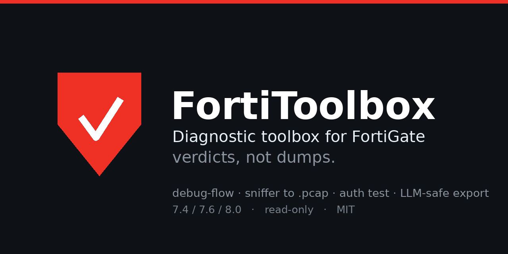
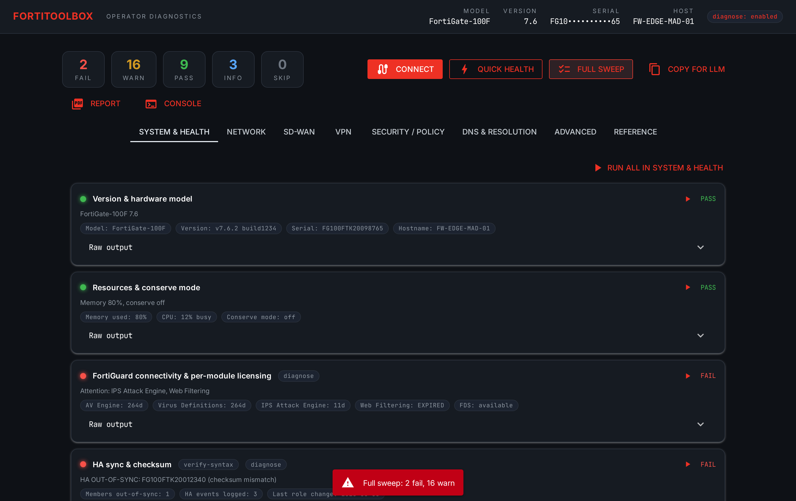
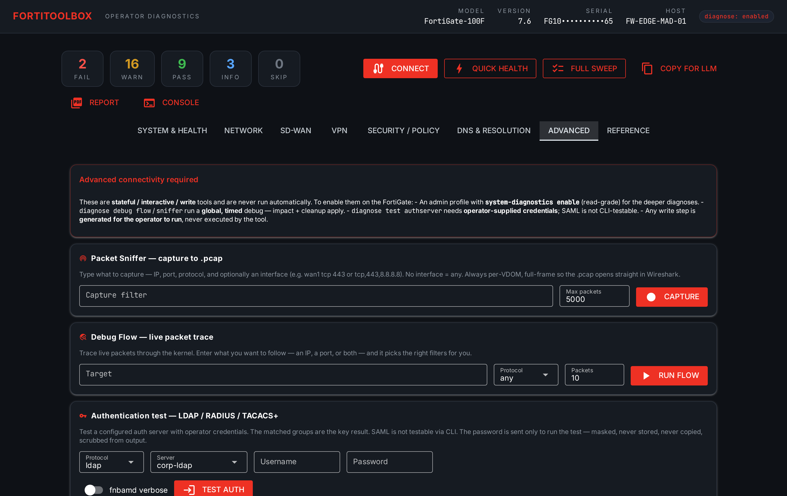

# FortiToolbox

A diagnostic dashboard for FortiGate. You connect, run the checks, and it tells you
what's wrong in plain verdicts — instead of leaving you to squint at a few thousand
lines of `diagnose` output. PASS / WARN / FAIL, each with the one number that matters.

FortiOS 7.4 / 7.6 / 8.0. Read-only. Pure Python, runs locally in your browser.




## Why

Every time I open an unfamiliar FortiGate I end up typing the same dozen-odd `get`
and `diagnose` commands — HA sync, conserve mode, cert expiry, SD-WAN members, why a
packet got dropped — and reading the output by eye. This runs that pass for me and
shows the conclusions instead of the dumps.

It ships with a **simulated device**, so you can try the whole thing right now
without touching a box.

## Install

Python 3.10+. No compiled dependencies (NiceGUI, netmiko, PyYAML).

```bash
git clone https://github.com/Metzcall/fortitoolbox.git
cd fortitoolbox

python3 -m venv .venv
source .venv/bin/activate          # Linux / macOS
# .venv\Scripts\activate           # Windows

pip install fortitoolbox-0.4.4-py3-none-any.whl
fortitoolbox
```

Open `http://localhost:8080`. It binds to localhost only — it holds a live SSH
session and raw firewall output. **Connect** takes `host` or `host:port` (defaults
to 22). Leave Demo mode on to explore without a device.

## What it checks

Each check returns a verdict plus the metric that matters, grouped into tabs:

- **System & Health** — version/model, resources & conserve (kernel + shared-mem),
  FortiGuard licensing, HA sync + failover history, NTP, crashlog, config-error-log,
  certificate expiry, hardware sensors, FortiAnalyzer logging.
- **Network** — interface link (per-NIC), routing sanity, BGP/OSPF adjacencies, ARP,
  policy-routes, sessions, interface error/drop counters.
- **SD-WAN** — health-check SLA, service path selection, members, SLA flap log.
- **VPN** — IPsec phase-2 selectors, IKE phase-1, SSL-VPN sessions, per-SA traffic.
- **Security / DNS** — dead policies, web-filter rating, DNS config + server
  readiness + resolution.

## Interactive tools (Advanced tab)



- **Debug flow** — bounded packet trace with a smart filter (type `tcp,443,1.1.1.1`).
  Shows only what actually happens (policy, NAT, UTM, offload) and gives a
  plain-language reason when it drops (RPF, implicit deny, …).
- **Packet sniffer** — live capture with a Stop button and a one-click **.pcap**
  download for Wireshark.
- **Auth test** — LDAP / RADIUS / TACACS+ with your test credentials; surfaces the
  groups the server returns.

Plus a live SSH console, an obfuscated **Copy for LLM** (serials/IPs tokenized,
secrets dropped, leak-checked), a one-page **PDF report**, status drill-down, and
VDOM support.

## Honest caveats

- Commands flagged `verify: true` and the parsers are calibrated against the docs and
  lab output, but wording shifts between MRs and platforms. **Validate against your
  own gear before trusting it in production.** In demo mode it's deterministic.
- It's `0.x`. It works and it's been used, but it's young — expect rough edges, and
  please tell me about them.

## Contributing

Adding a check is one entry in `catalog.yaml` plus one `@parser` function — see
[CONTRIBUTING.md](CONTRIBUTING.md). The most useful PRs right now are **parser fixes
for real-device output** (paste a real `diagnose` dump in an issue) and new checks.

## License

MIT — use it, fork it, ship it.

## Architecture

`connector (ssh | mock)` → `Engine(catalog.yaml)` → `@parser(id) → CheckResult` →
`Obfuscator` → `NiceGUI`. The catalog is data; the UI, tabs and kits derive from it.
